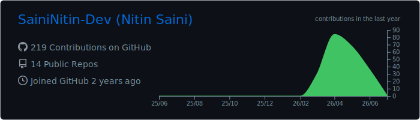

# Hey there!! I'm Nitin 👋
### CS Student | Full Stack Dev | Building things that (sometimes) work

---

## 📊 GitHub Stats:

---

## 🌐 Socials:

  

---

## 💻 Tech Stack:

                        

---

## 🙋 About Me:
🔨 **I'm currently building**
- 🔹 **Nourish AI** — an AI-powered nutrition tracking web app with a 
  conversational coach that can log meals, hydration, and supplements 
  via tool calling. Built with Next.js, Prisma & Groq.
- 🔹 **Gym Wars** — a competitive fitness tracking web app for friend 
  groups. Built with React, Vite & Supabase. Features leaderboards, 
  streaks, weekly challenges, a Hall of Fame, and an admin panel. 
  (Completed & Deployed)

🌱 **I'm currently learning**
- 🔹 Advanced React patterns and scalable frontend architecture
- 🔹 Backend system design and REST API best practices (Priority)
- 🔹 AI tool calling, LLM integration, and agentic workflows

💬 **Ask me about**
- 🔹 React, Next.js, Node.js, Supabase, Prisma
- 🔹 Building full-stack apps from scratch as a student
- 🔹 LLM integration, tool calling, and AI-powered features

📬 **Open to internships** in software development, full-stack, or AI 
engineering roles

⚡ **Fun fact** — I built a leaderboard app just to beat my friends at 
the gym. My code works. I'm just not always sure why.

---

<picture>
  <source media="(prefers-color-scheme: dark)" srcset="https://raw.githubusercontent.com/ItsNitinSaini/ItsNitinSaini/output/github-contribution-grid-snake-dark.svg" />
  <source media="(prefers-color-scheme: light)" srcset="https://raw.githubusercontent.com/ItsNitinSaini/ItsNitinSaini/output/github-contribution-grid-snake-dark.svg" />
  
</picture>

---

### ✍️ Random Dev Quote

---
